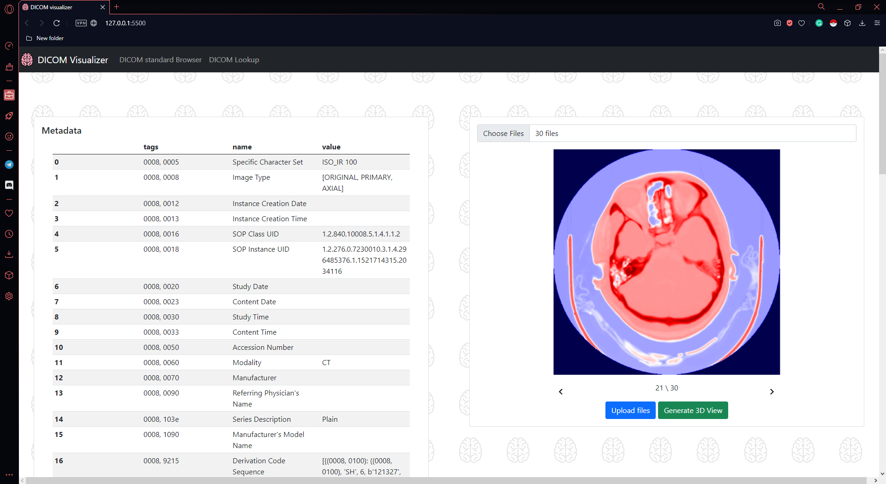
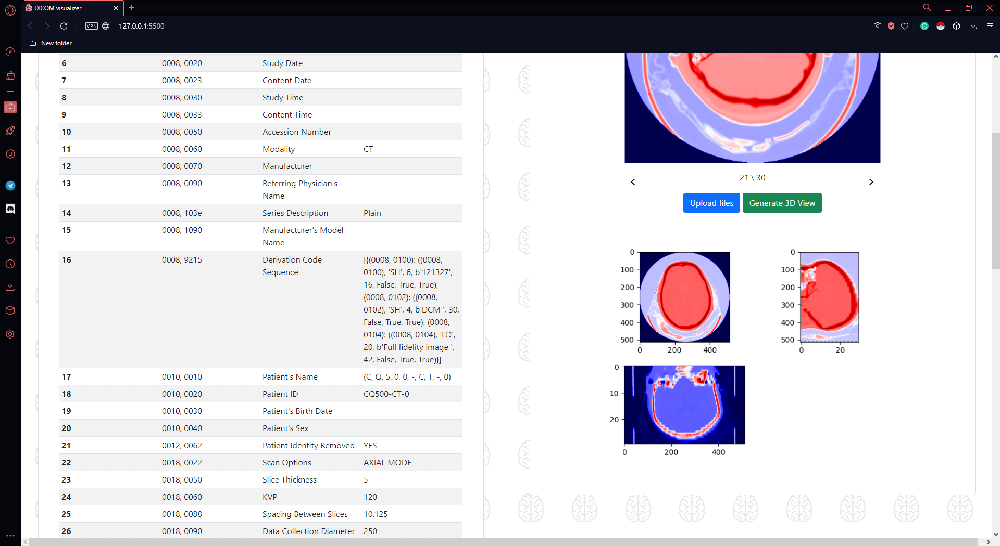

# Zadanie na 3
Wyświetlenie metadanych w formie czytelnej dla użytkownika jest zrealizowane w postaci aplikacji klient-serwer,
gdzie klient jest po prostu interfejsem graficznym uzytkownika. Żeby włączyć serwer nalezy uruchomić skrypt ``run.py`` 
oraz stronę internetową zawartą w katalogu ``web``.

### Obrazki wyglądu GUI





### Dodatkowe informacje
Dane można wyświetlić również w terminalu i w tym celu należy wywołać funkcję ``print_DICOM_in_terminal`` z pliku 
``DICOM_parser.py`` np. w ten sposób:

```python
print_DICOM_in_terminal('dcm_files/example_dicom.dcm')
```

 